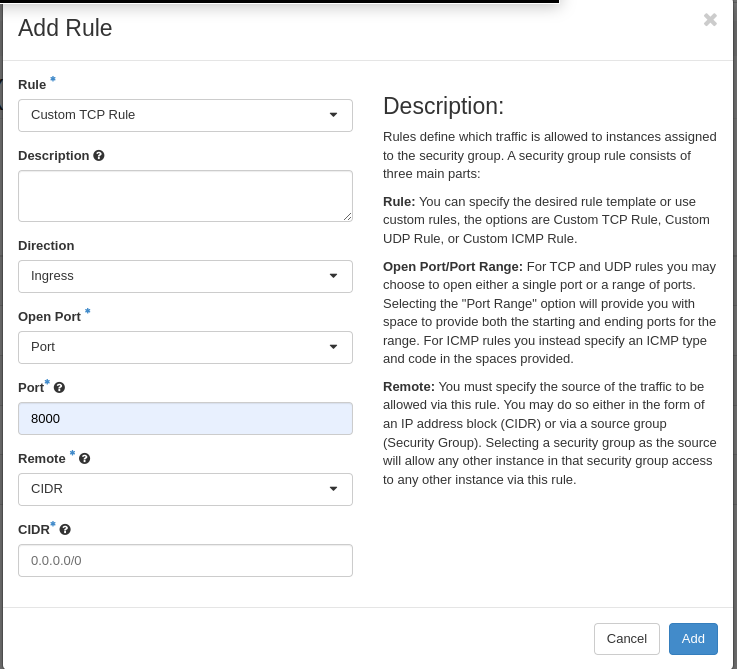

# Running Jupyterlab

JupyterLab is an interactive development environment that combines code execution, documentation, and collaboration features to facilitate data analysis, prototyping, and software development workflows.

In this tutorial we're going to: 
 - Create a security group with traffic rules
 - Create a new instance
 - Install NVIDIA drivers
 - Install miniconda3
 - Install Jupyterlab

## Creating a new security group for Jupyterlab. 

We will create a new security group with traffic rules to allow traffic to our Jupyterlab instance. 

Go to the security groups view of the network section [Security groups](https://create.leaf.cloud/project/security_groups/).

1. Press Create Security Group
1. Name the security group "jupyter-hub" and add a fitting description
1. Press Create Security Group
1. Locate your newly created security group in the overview and press "Manage Rules".
1. Press Add rule



1. Fill in the form according to the picture and click add.

## Creating the instance

To create the new instance, go to the instance view of the [dashboard](https://create.leaf.cloud/project/instances/).

1. Press Launch instance
1. In the Source tab select "Image" and the boot source
1. Select the `Ubuntu-22.04` image
1. Set the volume size to 40GB
1. As the flavor select any gpu flavor, starting with `eg1`.
1. Select a network, to give the instance a public IP address use the `external` network
1. Select a key pair, this key pair will be used to `SSH` into the machine
1. Add the jupyter-hub security group
1. Press "Launch Instance"
1. Wait until instance reaches running status.

## Connect to your instance

Open your terminal and enter the following:

``` shell
ssh [ubuntu]@[Instance Public IP Address]
```

Once you've connected to your instance you can proceed to update it:

    sudo apt update &&
    sudo apt -y upgrade &&
    sudo apt -y dist-upgrade &&
    sudo apt -y autoremove &&
    sudo apt -y autoclean


## Install NVIDIA drivers

You can find the latest version of NVIDIA drivers here:
https://packages.ubuntu.com/search?suite=default&section=all&arch=any&keywords=nvidia-driver-&searchon=names

Install the latest driver

``` shell
sudo apt install nvidia-driver-535-server

```

After successfully installing the NVIDIA driver reboot your instance

``` shell
sudo reboot
```

Connect to your instance again after reboot. 

Check that the drivers are correctly installed and active:

``` shell
nvidia-smi
```

## Install Miniconda3

``` shell
curl -O https://repo.anaconda.com/miniconda/Miniconda3-latest-Linux-x86_64.sh
sh Miniconda3-latest-Linux-x86_64.sh
```

Press enter to start the installation off Miniconda. 
Read the terms and accept them by typing "yes" 

After installation reload your shell

``` shell
source .bashrc
```

Create a new conda environment and activate.

``` shell
conda create -n pytorch-env
conda activate pytorch-env
```

Install conda packages:

``` shell
conda install pytorch torchvision torchaudio pytorch-cuda=11.7 -c pytorch -c nvidia
conda install -c conda-forge jupyterlab
```

You can now start your JupyterHub server by running:

``` shell
jupyter lab --ip [Instance Public IP] --port 8000
```

In the console logs you can find the startup url of Jupyterlab.
This also contains the authorisation token.