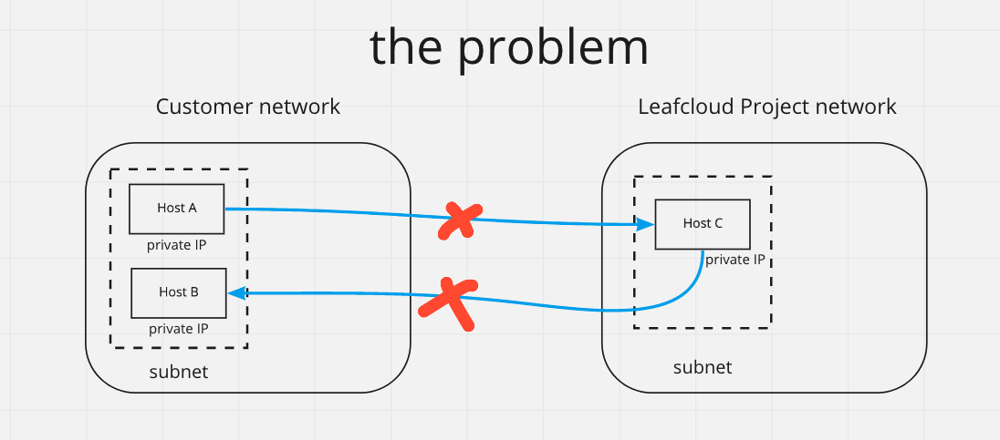
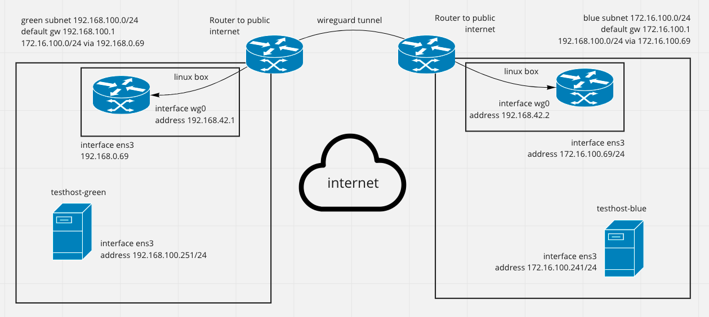

# Making a site to site VPN

The goal of this guide is to show you how to setup a secure tunnel between two different networks and setup routing such that all hosts from one side (subnet) can reach all hosts on the other side (subnet). 

The problem that a customer may face is that (s)he wants to use some services in an existing network but also utilize the benefits of Leafcloud. In secure networks generally a problem arises around how to make the new hosts in Leafcloud routable from the existing network and vice-versa. Typically there is no physical link between these sites, so a tunnel would need to be created to transit the public internet.

As this illustration shows the problem is that there is no route between hosts in the different networks.

## Welcome to the topic of Site to Site VPNs

We will cover the following topics:

1. Choosing the technology for setting up a tunnel over the internet
2. Setting up the tunnel
3. Configure the hosts/routers to forward traffic
4. Adding static routes to the default router

### Choosing a technology for a tunnel over the internet 

**Choosing a protocol**

There are different technologies that you may use for setting up the tunnel that traverses the internet. IVPN has a good [side-by-side comparison](https://www.ivpn.net/pptp-vs-ipsec-ikev2-vs-openvpn-vs-wireguard/) of what protocols have which features, and we will not repeat that. What is best for you depends on your situation, and what you have already. If you don't have any prior experience I recommend Wireguard as it is fast, flexible and is relatively easier to setup.

**Choosing router software**

Since we'll be configuring routing, you can choose between

* Using a special router OS that is meant for this, such as VyOS or pfSense. Both are open-source projects and allow usage for free, but make it easier if you pay. Benefits include that configuration is somewhat easier, because it is made for this purpose. But it might be a bit harder to get and launch the instance.
* Using a common linux OS such as Debian or Ubuntu. Benefits are that its easy to get such machine, but you may find that you will need to do more work to learn how to configure and to make sure that configuration survives a reboot.

### Setting up a wireguard tunnel

To setup the tunnel I recommend following the [quickstart on wireguard.com](https://www.wireguard.com/quickstart/) (for linux hosts). Or the guide on [setting up a tunnel on vyos](https://docs.vyos.io/en/equuleus/configuration/interfaces/wireguard.html).

In order for you to establish the tunnel you will need to add a rule to your firewall so that the wireguard service to be reached from the internet.

You should now be able to ping the other side of the tunnel on the IP of the new network you defined on the wireguard interface. 

### Setting up routing 

**Important!** In Leafcloud / OpenStack by default a security feature is enabled which blocks unknown ip-address - MAC-address pairs. For the port on which your router host is connected to the network this will need to be disabled for any routing to function.

When done the setup will look like this:

The key is that on the router we need to add a static route for the network on the other side. On debian something like `ip route add 192.168.100.0/24 via 172.16.100.69 dev interface wg0`. This tells the router to forward packets to the other side of the tunnel if they were destined fo that subnet.

### Conclusion
It is pretty straightforward to create a pair of routers with a VPN tunnel in between, and it is expected to work.