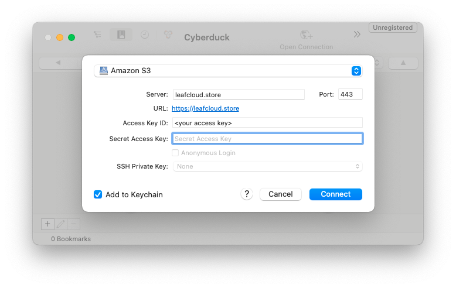

# Using Leafcloud Object Storage
Leafcloud Object storage is a flexible service meant for storing 'objects' such as files (images, documents, binaries), logs and many other types of objects. As Leafcloud is a managed server you don't have to worry about maintaining servers in order to benefit from this scalable service.

Object storage has a concept of containers (also called 'buckets'), these define a group of objects. A container can be set to private (the default) and public. 

When a container is set to public, the contents of the container can be accesses on the publicly available web address. The address is built up like https://leafcloud.store/ + <container_name\>/ + <path\>/filename.ext. For example, this cat picture: [https://leafcloud.store/test/cat-picture.jpg](https://leafcloud.store/test/cat-picture.jpg)

There is no limit to how much you can store in a container, and you pay only for space that you use. See our [pricing](https://www.leaf.cloud/pricing).

## Access Object Storage from the dashboard.
Navigate to *Object Store > Containers*. From here you can create and browse containers and change the public/private setting.

## Accessing Object storage from your computer

### Setting up the usage of object storage
In order to use Openstack Object storage you'll need to install and setup the Openstack CLI

Follow the instructions to install and configure the Openstack CLI  [Using the Openstack CLI - Leafcloud Tutorials](https://docs.leaf.cloud/en/latest/Getting-Started/Using-Openstack-CLI/)


### Making an object storage container (bucket)
Objects (files) are organized in so-called containers, or buckets, there is a limit to how many containers you can create, and a bucket is typically created for each project or service.

Containers need to have a name that is unique for all Leafcloud users. In other words, it may be that a name is already taken. 

```sh
openstack container create <container_name>
```

Storage containers can also be viewed using the [dashboard](https://create.leaf.cloud/project/containers/)  under Object Store

### Up- and downloading files to object storage using the native client
Openstack object storage (also called *Swift*) uses the default OpenStack authentication and authorization system. If you are authorized for a project you are automatically authorized for its containers and can use the CLI.

**List the objects in a container:**
```sh
openstack object list <container_name>
```

**Copy an item to the container:**
```
openstack object create <container_name>/<path>/ <local_file>
```
Here, you can specify any path you like, or omit the path to put the object in the container root. There is no need to create a folder first. Under the hood there is no real folder structure. Paths' are just for your convenience.

### Creating S3 compatible credentials
As an alternative to the OpenStack native container interface you can also use the de-facto industry standard "Amazon S3 interface". Out of convenience almost all cloud providers support this XML interface.

To use the S3-compatible interface you will need to make and EC2 credential These credentials have access to your project and the storage containers within.

```sh
openstack ec2 credentials create
```

And example result contains:
```text
access | 67fd5d4526114c97b87ace3981bd75cb
secret | 9da048142f604573bef0fa97sfb3509d                                                                                                         
```

These 'access' and 'secret' strings are the username and password for the object storage containers. Keep them safe. You cannot retrieve them later. But you can create new ones.

### Access you bucket from your local computer using a GUI
There are many different clients available which support "Amazon S3", And Leafcloud object storage is fully compatible with them. One of the best (free) clients is [Cyberduck](https://cyberduck.io/download/). It's open-source and payment is optional. 

1. Use **leafcloud.store** as the server address.
2. Use your **access** key for Access Key ID
3. Use your **secret** for Secret Access Key





### Access your bucket from your server / using a CLI 
Again, there are many different clients available which support S3. One of the best clients that we like is the [Minio Client](https://docs.min.io/docs/minio-client-complete-guide.html). You don't need to use the Minio server to use the Minio client.

Once you have installed the client you can use the following command to configure Leafcloud object storage:
```sh
mc alias set leafcloud https://leafcloud.store [YOUR-ACCESS-KEY] [YOUR-SECRET-KEY]
```
You can then find the configuation file in ~/.mc/config.json

**Test if you can list your buckets with:**
```sh
$ mc ls leafcloud
```

**You can copy things to the bucket like so:**
```sh
mc copy <local_file> leafcloud/<bucket_name>/<path>/
```
